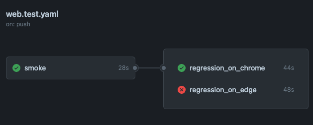
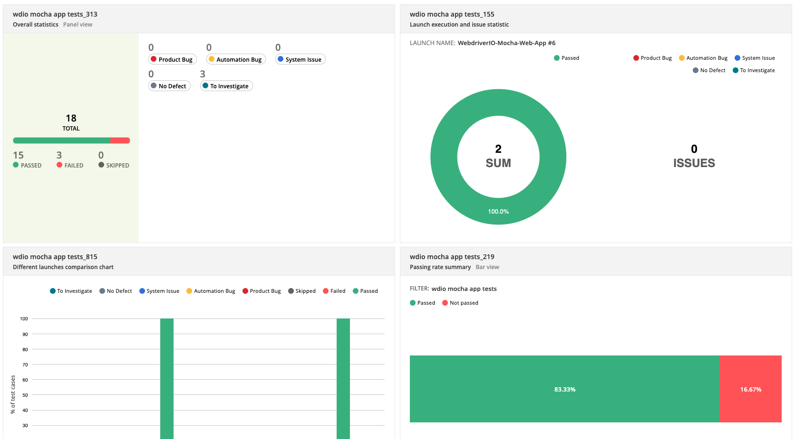

# WebdriverIO TypeScript Mocha Framework

This is a sample project that uses WebdriverIO and TypeScript. It includes examples of the PageObject pattern and some practical examples for using WebdriverIO for cross browser and parallel testing.

### Requirements

[](https://nodejs.org/en/download/)
[](https://code.visualstudio.com/download)

### Getting Started

Clone Repository

```bash
git clone https://github.com/sadabnepal/webdriverio-ts-mocha.git
cd webdriverio-ts-mocha
```

Install packages:

```bash
npm install
```

Run tests:

```bash
npm run test            [ test in chrome ]
npm run test:edge       [ test in edge ]
npm run cross-browser   [ test in chrome and edge ]
npm run test:docker     [ test inside container ]
```

Docker Run:

```bash
docker compose -f tests/docker/docker-compose.yml up -d
docker compose -f tests/docker/docker-compose.yml down

docker compose -f tests/docker/docker-compose-arm.yml up -d  [m1 chip mac user]
docker compose -f tests/docker/docker-compose-arm.yml down
```
open http://localhost:4444/ to check if server is running

Generate report:

```bash
npm run report
```

Cleanup Report folder

```bash
npm run cleanup
```
### Github Action Workflow


### Report Portal Integration
- Setup: follow https://reportportal.io/installation
- Login: Open http://localhost:8080/ and login with time user `superadmin` and password `erebus`
- Generate API key:
    - Click on bottom left of logged in user --> click on `Profile`
    - Click on `API KEYS` --> `Generate API Key` --> copy the generated key
    - Create `.env` file in root project folder. Refer `.env.example` file
    - Paste your API key into `.env` file as `REPORT_PORTAL_KEY=<your api key>`
- Enter `REPORT_PORTAL_PROJECT=<project_assignment>` into `.env`. Value can be found on `PROJECT ASSIGNMENT` tab of user profile
- Other details are updated in `tests/config/wdio.reportPortal.ts` file



### Key Features
- Custom types for web elements
- Parallel execution and Cross browser testing
- Docker for run test again/using containerization
- Github actions CI/CD integration
- Report portal integration

### Folder Structure

```ini
├───.github
├───.vscode
├───tests
|    ├───config
|    ├───pages
|    ├───specs
|    ├───static
|    └───types
├───package-lock.json
├───package.json
├───README.md
└───tsconfig.json
```

### Sample Report


